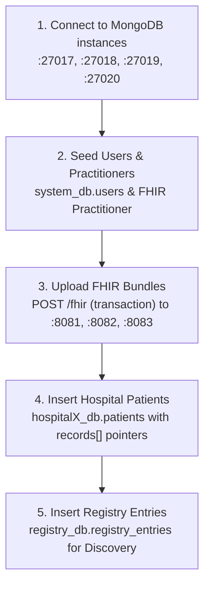

# Patient Seed Data — Medical History & Seeding Specification (Indian Cohort)

> **File:** `06_patient_seed_data_spec.md`  
> **Status:** **Approved Implementation Specification** (Aligned with System Architecture, Docker Environment, and Demo Phases)  
> **Purpose:** Comprehensive specification for seeding six realistic Indian patient profiles across the three federated hospital nodes. Replaces generic/US Synthea data with clinically sound, multi-institutional histories that exercise discovery, standard consent, sensitive category gating, break-glass emergency access, and ML anomaly detection.  
> **Audience:** Implementation engineers building the data generation scripts, FHIR transaction bundles, and MongoDB ingestion pipelines.

---

## 0. Architecture & Environment Context

This specification maps directly to the live Docker infrastructure and system topology defined in `SETUP_GUIDE.md`, `docs/00_system_architecture.md`, and `docs/01_database_schema.md`.

### 0.1 Federated Node Topology & Connection Map

```
┌─────────────────────────────────────────────────────────────────────────────────┐
│                           CENTRAL FEDERATION SYSTEM                             │
│  API Gateway: http://localhost:3000                                              │
│  Central MongoDB: mongodb://localhost:27020                                      │
│    ├── system_db   (users, consent_policies, access_tokens, audit_events)        │
│    └── registry_db (registry_entries - Discovery Service Index)                 │
└───────────────────────┬─────────────────┬──────────────────┬────────────────────┘
                        │                 │                  │
         ┌──────────────▼──────┐   ┌──────▼──────────────┐   │
         │   HOSPITAL NODE 1   │   │   HOSPITAL NODE 2   │   │
         │   Apollo Memorial   │   │  Fortis Healthcare  │   │
         ├─────────────────────┤   ├─────────────────────┤   │
         │ ID: HOSP-1          │   │ ID: HOSP-2          │   │
         │ FHIR: :8081/fhir    │   │ FHIR: :8082/fhir    │   │
         │ Mongo: :27017       │   │ Mongo: :27018       │   │
         │   hospital1_db      │   │   hospital2_db      │   │
         └─────────────────────┘   └─────────────────────┘   │
                                                             ▼
                                                   ┌─────────────────────┐
                                                   │   HOSPITAL NODE 3   │
                                                   │ Max Super Specialty │
                                                   ├─────────────────────┤
                                                   │ ID: HOSP-3          │
                                                   │ FHIR: :8083/fhir    │
                                                   │ Mongo: :27019       │
                                                   │   hospital3_db      │
                                                   └─────────────────────┘
```

| Node # | Institution Name | `institution_id` | FHIR URL (Host / Local) | FHIR URL (Internal Docker) | MongoDB Port & DB Name |
|---|---|---|---|---|---|
| **Hospital 1** | **Apollo Memorial Hospital** | `HOSP-1` | `http://localhost:8081/fhir` | `http://hospital1-fhir:8080/fhir` | `localhost:27017` / `hospital1_db` |
| **Hospital 2** | **Fortis Healthcare Center** | `HOSP-2` | `http://localhost:8082/fhir` | `http://hospital2-fhir:8080/fhir` | `localhost:27018` / `hospital2_db` |
| **Hospital 3** | **Max Super Specialty Hospital** | `HOSP-3` | `http://localhost:8083/fhir` | `http://hospital3-fhir:8080/fhir` | `localhost:27019` / `hospital3_db` |
| **System** | Central Registry & Auth | `SYSTEM` | N/A | N/A | `localhost:27020` / `system_db`, `registry_db` |

### 0.2 Datastores to be Populated

1. **Hospital HAPI FHIR R4 Nodes (`:8081`, `:8082`, `:8083`)**:
   - `Practitioner` resources (attending physicians, surgeons, specialists).
   - `Patient` resource (demographics, national ABHA identifier, local MRN).
   - Clinical Resources: `Encounter`, `Condition`, `MedicationRequest`, `Observation`, `DiagnosticReport`, `Procedure`, `Immunization`, `AllergyIntolerance`.
2. **Local Hospital MongoDB (`hospital1_db`, `hospital2_db`, `hospital3_db`)**:
   - Collection: `patients` — Stores local patient index, safe harbor emergency data, and metadata pointer array (`records[]`) per `docs/01_database_schema.md`.
3. **Central MongoDB Registry (`registry_db`)**:
   - Collection: `registry_entries` — Powers the Discovery Service (`GET /patient/search?health_id=...`). Stores institutional record summaries, available categories, sensitive categories, and FHIR endpoints without exposing raw clinical data.
4. **Central System Database (`system_db`)**:
   - Collection: `users` — Seeded accounts for doctors, patients, and guardians for authentication via `POST /auth/login`.

### 0.3 Master Reference Date

> **Reference "Today": 1 October 2025**
All chronological calculations (patient ages, "X months ago", follow-up timelines, and pending vaccinations) are strictly anchored to **2025-10-01**.

---

## 1. Conventions & Vocabulary

### 1.1 ID Formatting Rules

| ID Type | Structure | Format Example | Notes |
|---|---|---|---|
| **ABHA Health ID** | `ABHA-XXXX-XXXX-XXXX` | `ABHA-4471-2298-6613` | Primary Indian National Health ID |
| **Demo 1 Test Alias** | `ABHA-DEMO-001` | `ABHA-DEMO-001` | Preserved on Patient A as secondary identifier for backward compatibility |
| **Hospital MRN** | `<HOSP>-PAT-<SEQ>` | `APOLLO-PAT-101`, `FORTIS-PAT-202` | Local institutional medical record number |
| **Record ID** | `REC-<HOSP>-<SEQ>` | `REC-HOSP1-001`, `REC-HOSP2-014` | Pointer ID in `patients.records[]` |
| **Doctor User ID** | `DOC-<ID>` | `DOC-1`, `DOC-2`, `DOC-3`, `DOC-ONC-01` | User login and metadata identifier |
| **FHIR Practitioner** | `pract-<specialty>-<hosp>` | `pract-onc-apollo`, `pract-ortho-max` | Resource ID in HAPI FHIR |

### 1.2 Category Vocabulary & FHIR Resource Mapping

The system enforces a **strict 8-category vocabulary** for MongoDB metadata filtering (`category` field). Surgeries and clinical interventions map to FHIR `Procedure` resources but are indexed under the `encounter` category at the metadata layer.

| Category (MongoDB) | FHIR R4 Resource | Purpose / Description | Standard Coding System |
|---|---|---|---|
| `allergy` | `AllergyIntolerance` | Food, environmental, and critical drug allergies | SNOMED-CT |
| `medication` | `MedicationRequest` | Prescriptions, active/historical regimens | RxNorm / ATC |
| `condition` | `Condition` | Diagnoses, acute episodes, chronic illnesses | SNOMED-CT / ICD-10 |
| `lab_result` | `DiagnosticReport` + `Observation` | Path lab panels, blood tests, biopsies, LFTs | LOINC |
| `imaging` | `ImagingStudy` + `Media` / `DocumentReference` | X-Rays, Mammography, MRIs, CT scans | DICOM / LOINC |
| `vitals` | `Observation` (vital-signs) | BP, pulse, weight, growth metrics | LOINC |
| `encounter` | `Encounter` (+ `Procedure`) | Outpatient visits, hospitalizations, surgeries | SNOMED-CT / CPT |
| `immunization` | `Immunization` | UIP childhood vaccines, boosters | CVX / SNOMED-CT |

---

## 2. Sensitive Data & Multi-Gate Access Architecture

Federated healthcare records contain highly private clinical notes. In FEDRA, access to sensitive data is **strictly gated** and never exposed through normal discovery or standard consent.

### 2.1 Fixed Vocabulary of Sensitive Categories
- `null`: Standard clinical data (vitals, allergies, routine labs).
- `psychiatric`: Mental health diagnoses, psycho-oncology counseling, SSRI medications.
- `reproductive`: Contraceptive prescriptions, obstetrics notes, sexual health counseling.
- `substance_abuse`: Alcohol / drug dependence records, de-addiction therapy, rehab LFT monitoring.
- `hiv`: Kept in vocabulary, but **not used** in this synthetic cohort.

### 2.2 Security Tagging Rules for Seeding

Every sensitive record must be marked at **both** storage layers:
1. **MongoDB Metadata (`patients.records[]`)**:
   `"sensitive_category": "psychiatric" | "reproductive" | "substance_abuse"`
2. **FHIR R4 Resource (`meta.security`)**:
   ```json
   "meta": {
     "security": [
       {
         "system": "http://terminology.hl7.org/CodeSystem/v3-ActCode",
         "code": "PSY",
         "display": "psychiatry clinic"
       },
       {
         "system": "http://terminology.hl7.org/CodeSystem/v3-Confidentiality",
         "code": "R",
         "display": "Restricted"
       }
     ]
   }
   ```
   - Codes: `PSY` for psychiatric, `SEX` for reproductive/sexual health, `ETH` for substance abuse/alcohol dependence.

### 2.3 The 4-Layer Access Gate

1. **Discovery Privacy:** `GET /patient/search?health_id=...` returns `sensitive_categories_present: ["psychiatric"]` in the record summary. The doctor is informed that sensitive records exist at an institution, but cannot view the details, dates, or clinical content.
2. **Standard Consent Barrier:** When a patient grants standard consent (`POST /consent/grant`), all sensitive category scopes default to `false`.
3. **Explicit Patient Opt-In Route:** The treating doctor must issue an explicit category request. The patient receives an in-app prompt and must deliberately approve that specific sensitive category (`POST /consent/sensitive`).
4. **Emergency Break-Glass Invariant (Demo 2 Act 3):** Under break-glass emergency override (`POST /consent/break-glass`), ER clinicians obtain instant access to safe harbor data, conditions, allergies, and vitals. **However, sensitive categories (psychiatric, reproductive, substance abuse) REMAIN LOCKED**. They are never exposed during emergency overrides.
5. **Gateway Aggregation Filter:** When `POST /records/fetch` aggregates FHIR resources, any resource whose `sensitive_category` is not explicitly permitted in the active token is redacted from the response.

---

## 3. Master Doctor & Practitioner Directory

To provide realistic clinical context, attending doctors are defined across all three hospitals. They exist as **FHIR `Practitioner` resources** on the respective hospital node, and active clinicians also have user logins in `system_db.users`.

| Doctor ID | Full Name & Qualifications | Institution | Department / Specialty | FHIR Resource ID | Login Account (`system_db.users`) | Demo Role |
|---|---|---|---|---|---|---|
| `DOC-1` | **Dr. Aditya Sharma**, MBBS, MD, DM | `HOSP-1` (Apollo) | Cardiology | `pract-cardio-apollo` | `doc1@test.com` | Primary Cardiologist; Saraswathi Nair care |
| `DOC-2` | **Dr. Priya Patel**, MBBS, MD | `HOSP-2` (Fortis) | General Medicine | `pract-genmed-fortis` | `doc2@test.com` | **Doctor B (Demo 1)**; Krishnamurthy primary care |
| `DOC-3` | **Dr. Rajesh Iyer**, MBBS, MS (Trauma) | `HOSP-3` (Max) | Emergency & Trauma | `pract-er-max` | `doc3@test.com` | **Doctor C (Demo 2 Break-Glass)** |
| `DOC-EMERGENCY` | **Dr. Rahul Verma**, MBBS, MEM | `HOSP-1` (Apollo) | Emergency Medicine | `pract-er-apollo` | `er@test.com` | Apollo ER Physician |
| `DOC-ONC-01` | **Dr. Ananya Sen**, MBBS, MS, MCh | `HOSP-1` (Apollo) | Surgical & Medical Oncology | `pract-onc-apollo` | N/A (Attending) | Lakshmi Venkatesh oncology care |
| `DOC-PSY-01` | **Dr. Shalini Mukhopadhyay**, MBBS, MD | `HOSP-1` (Apollo) | Psycho-Oncology / Psychiatry | `pract-psy-apollo` | N/A (Attending) | Lakshmi mental health (**Sensitive Gate**) |
| `DOC-ORTHO-01` | **Dr. K. S. Venkatesh**, MBBS, MS (Ortho) | `HOSP-1` (Apollo) | Orthopedic Surgery | `pract-ortho-apollo` | N/A (Attending) | Krishnamurthy hip replacement surgery |
| `DOC-GYN-01` | **Dr. Sunita Deshmukh**, MBBS, DGO, DNB | `HOSP-1` (Apollo) | Obstetrics & Gynecology | `pract-gyn-apollo` | N/A (Attending) | Lakshmi delivery; Ananya reproductive (**Sensitive**) |
| `DOC-REHAB-01` | **Dr. Farooq Abdullah**, MBBS, MD (Psych) | `HOSP-1` (Apollo) | Addiction Medicine / Rehab | `pract-rehab-apollo` | N/A (Attending) | Vikram de-addiction (**Sensitive Gate**) |
| `DOC-OPHTH-01` | **Dr. Meenakshi Sundaram**, MBBS, MS (Ophth) | `HOSP-2` (Fortis) | Ophthalmology (Day Care) | `pract-ophth-fortis` | N/A (Attending) | Krishnamurthy cataract surgery |
| `DOC-PED-01` | **Dr. Neha Kulkarni**, MBBS, MD (Pediatrics) | `HOSP-2` (Fortis) | Pediatrics & Neonatology | `pract-ped-fortis` | N/A (Attending) | Anika infant care; Ananya childhood vaccine |
| `DOC-ORTHO-02` | **Dr. Arvind Menon**, MBBS, MS (Ortho) | `HOSP-3` (Max) | Orthopedics & Sports Injury | `pract-ortho-max` | N/A (Attending) | Vikram ACL repair; Saraswathi wrist casting |

> **Default Password:** All interactive login accounts (`doc1@test.com`, `doc2@test.com`, `doc3@test.com`, `er@test.com`, patient accounts) use `password123` hashed with bcrypt (salt rounds: 10).

---

## 4. Patient & Hospital Distribution Matrix

| Patient Name | Age & Gender | Primary / Home Hospital | Secondary Hospital | Sensitive Categories Present | Primary Demo Purpose |
|---|---|---|---|---|---|
| **Lakshmi Venkatesh** | 47, F | **Apollo (`HOSP-1`)** | — *(Single Hospital)* | `psychiatric` | **Patient A (Demo 1 & Demo 2)** |
| **Krishnamurthy Rao** | 84, M | **Fortis (`HOSP-2`)** | **Apollo (`HOSP-1`)** | None | Geriatric chronic care, surgery referral |
| **Saraswathi Nair** | 63, F | **Apollo (`HOSP-1`)** | **Max (`HOSP-3`)** | None | Cardiology home + emergency travel injury |
| **Ananya Reddy** | 23, F | **Fortis (`HOSP-2`)** | **Apollo (`HOSP-1`)** | `reproductive` | Digital native: childhood UIP + adult care |
| **Vikram Shetty** | 33, M | **Max (`HOSP-3`)** | **Apollo (`HOSP-1`)** | `substance_abuse` | Sports injury + past de-addiction recovery |
| **Anika Pillai** | 9 mo, F | **Fortis (`HOSP-2`)** | — *(Single Hospital)* | None | Infant UIP schedule with pending vaccine dose |

---

## 5. Detailed Patient Specifications

---

### 5.1 Lakshmi Venkatesh — 47, F — "Patient A" (Cancer Survivor)

- **ABHA ID:** `ABHA-4471-2298-6613` *(Secondary FHIR alias identifier: `ABHA-DEMO-001`)*
- **Date of Birth:** `1978-03-12` (Age: 47)
- **Blood Type:** `O+` | **Gender:** `female`
- **Home Hospital:** Apollo Memorial Hospital (`HOSP-1`) — **Only** hospital with records
- **Safe Harbor Emergency Data:**
  - Critical Allergies: `Penicillin` (Severe anaphylactic reaction)
  - Emergency Contact: Husband, **Suresh Venkatesh** (`+91-9845012345`) — *Caregiver notified in Demo 2 break-glass*
- **Clinical Narrative:** General wellness through her 20s and 30s with an uncomplicated pregnancy in 2005. At age 45 (Jan 2023), diagnosed with Stage II breast cancer, undergoing chemotherapy, breast-conserving lumpectomy, and radiation. Prescribed adjuvant Tamoxifen. During treatment, she developed severe situational anxiety and depression, treated by psycho-oncology with therapy and Sertraline, now fully resolved.

#### Records to Seed at Apollo Memorial Hospital (`HOSP-1` / `hospital1_db` / `:8081`)

| Date | Category | FHIR Resource | Standard Code | Sensitive? | Attending Doctor | Clinical Details & Regimen |
|---|---|---|---|---|---|---|
| 2003-08-15 | `lab_result` | `DiagnosticReport` + `Observation` | LOINC: 58410-2 (CBC) | None | `DOC-1` | Routine wellness panel: CBC, lipid profile, all values within normal limits |
| 2005-11-20 | `encounter` | `Encounter` | SNOMED: 177184002 | None | `DOC-GYN-01` | Normal vaginal delivery; healthy full-term infant (3.2 kg) |
| 2010-06-10 | `lab_result` | `DiagnosticReport` + `Observation` | LOINC: 14635-7 (Vit D) | None | `DOC-1` | Routine annual checkup: mild Vitamin D deficiency (18 ng/mL) |
| 2010-06-10 | `medication` | `MedicationRequest` | RxNorm: 624647 | None | `DOC-1` | Cholecalciferol (Vitamin D3) 60,000 IU weekly for 8 weeks |
| 2015-09-04 | `lab_result` | `DiagnosticReport` + `Observation` | LOINC: 24331-1 (Lipid) | None | `DOC-1` | Routine wellness panel: HbA1c 5.4%, normal fasting glucose, normal lipids |
| 2020-02-18 | `lab_result` | `DiagnosticReport` + `Observation` | LOINC: 57021-8 (CBC) | None | `DOC-1` | Routine checkup panel: normal bloodwork; baseline mammogram advised |
| 2023-01-12 | `condition` | `Condition` | SNOMED: 307494002 | None | `DOC-ONC-01` | Palpable lump in upper-outer quadrant of left breast |
| 2023-01-16 | `imaging` | `ImagingStudy` + `Media` | LOINC: 24606-6 (MG) | None | `DOC-ONC-01` | Bilateral digital mammogram + targeted US: BI-RADS 4C suspicious mass |
| 2023-02-02 | `lab_result` | `DiagnosticReport` + `Observation` | SNOMED: 116741001 | None | `DOC-ONC-01` | Core needle biopsy: Invasive Ductal Carcinoma, Grade 2, ER+/PR+, HER2- |
| 2023-02-08 | `condition` | `Condition` | SNOMED: 254837009 | None | `DOC-ONC-01` | Confirmed Diagnosis: Stage IIA Invasive Breast Carcinoma (cT2N0M0) |
| 2023-03-01 | `medication` | `MedicationRequest` | RxNorm: 3639 / 3002 | None | `DOC-ONC-01` | AC-T Chemotherapy: Doxorubicin + Cyclophosphamide x 4 cycles, followed by Paclitaxel |
| 2023-04-14 | `condition` | `Condition` | SNOMED: 72883008 | `psychiatric` (PSY/R) | `DOC-PSY-01` | **Sensitive:** Adjustment disorder with mixed anxiety and depressed mood |
| 2023-04-18 | `medication` | `MedicationRequest` | RxNorm: 36437 | `psychiatric` (PSY/R) | `DOC-PSY-01` | **Sensitive:** Sertraline hydrochloride 50 mg oral daily |
| 2023-04 to 2023-11 | `encounter` | `Encounter` | SNOMED: 386477009 | `psychiatric` (PSY/R) | `DOC-PSY-01` | **Sensitive:** Six supportive cognitive-behavioral psycho-oncology counseling sessions |
| 2023-09-18 | `encounter` | `Procedure` + `Encounter` | SNOMED: 392021009 | None | `DOC-ONC-01` | Wide local excision (lumpectomy) + sentinel lymph node biopsy (clear margins) |
| 2023-10 to 2024-01 | `encounter` | `Procedure` + `Encounter` | SNOMED: 33195004 | None | `DOC-ONC-01` | Whole-breast adjuvant external beam radiation therapy (50 Gy in 25 fractions) |
| 2024-01-20 | `medication` | `MedicationRequest` | RxNorm: 36437 | `psychiatric` (PSY/R) | `DOC-PSY-01` | **Sensitive:** Sertraline successfully tapered and discontinued; anxiety in remission |
| 2024-02-05 | `medication` | `MedicationRequest` | RxNorm: 10324 | None | `DOC-ONC-01` | Tamoxifen citrate 20 mg oral daily (Adjuvant endocrine therapy, 5-year course) |
| 2024-08-12 | `lab_result` | `DiagnosticReport` + `Observation` | LOINC: 83082-8 (CA 15-3) | None | `DOC-ONC-01` | Post-treatment 6-month surveillance: CA 15-3 normal (14 U/mL), LFTs normal |
| 2025-02-14 | `imaging` | `ImagingStudy` | LOINC: 24606-6 | None | `DOC-ONC-01` | Annual surveillance mammogram: no evidence of local or regional recurrence |
| 2025-08-20 | `lab_result` | `DiagnosticReport` + `Observation` | LOINC: 58410-2 | None | `DOC-ONC-01` | Recent follow-up panel: CBC, metabolic profile, CA 15-3 normal; complete remission |

- **Mandatory Data Gaps:** No records prior to 2003 (age 25) — childhood records un-digitized. Absolutely zero records at Hospital 2 or Hospital 3.
- **Registry Entry Required:** Exactly one entry in `registry_db.registry_entries`:
  - `institution_id`: `HOSP-1` (Apollo)
  - `categories_present`: `["allergy", "medication", "condition", "lab_result", "imaging", "encounter"]`
  - `sensitive_categories_present`: `["psychiatric"]`

---

### 5.2 Krishnamurthy Rao — 84, M (Geriatric Chronic Care & Surgery)

- **ABHA ID:** `ABHA-7712-4456-9081`
- **Date of Birth:** `1941-06-20` (Age: 84)
- **Blood Type:** `B+` | **Gender:** `male`
- **Primary Hospital:** Fortis Healthcare Center (`HOSP-2`) — Long-term chronic care
- **Secondary Hospital:** Apollo Memorial Hospital (`HOSP-1`) — Hip fracture referral
- **Safe Harbor Emergency Data:**
  - Critical Allergies: None known (NKDA)
  - Emergency Contact: Son, **Suresh Rao** (`+91-9880023456`)

#### Records at Fortis Healthcare Center (`HOSP-2` / `hospital2_db` / `:8082`)

| Date | Category | FHIR Resource | Standard Code | Sensitive? | Attending Doctor | Clinical Details |
|---|---|---|---|---|---|---|
| 2005-03-14 | `condition` | `Condition` | SNOMED: 59621000 | None | `DOC-2` | Essential hypertension diagnosed |
| 2005-03-14 | `medication` | `MedicationRequest` | RxNorm: 17767 | None | `DOC-2` | Amlodipine 5 mg oral daily |
| 2010-07-22 | `condition` | `Condition` | SNOMED: 44054006 | None | `DOC-2` | Type 2 diabetes mellitus diagnosed |
| 2010-07-22 | `medication` | `MedicationRequest` | RxNorm: 6809 | None | `DOC-2` | Metformin 500 mg oral twice daily |
| 2013 to 2025 | `lab_result` | `DiagnosticReport` + `Observation` | LOINC: 4548-4 (HbA1c) | None | `DOC-2` | 14 bi-annual HbA1c panels (ranging 6.8% to 7.6%) & lipid panels |
| 2014-04-18 | `encounter` | `Procedure` + `Encounter` | SNOMED: 110473004 | None | `DOC-OPHTH-01` | Day Care Cataract Surgery: Phacoemulsification with intraocular lens (right eye) |
| 2019-11-09 | `encounter` | `Encounter` | SNOMED: 302866003 | None | `DOC-2` | Acute hypoglycemia admission (blood sugar 48 mg/dL); treated with IV dextrose |
| 2019-11-10 | `medication` | `MedicationRequest` | RxNorm: 6809 | None | `DOC-2` | Metformin reduced to 500 mg once daily post-hypoglycemia episode |
| 2025-04-15 | `lab_result` | `DiagnosticReport` + `Observation` | LOINC: 4548-4 | None | `DOC-2` | Recent HbA1c: 7.1%, BP: 132/82 mmHg; stable geriatric chronic control |

#### Records at Apollo Memorial Hospital (`HOSP-1` / `hospital1_db` / `:8081`)

| Date | Category | FHIR Resource | Standard Code | Sensitive? | Attending Doctor | Clinical Details |
|---|---|---|---|---|---|---|
| 2022-05-11 | `condition` | `Condition` | SNOMED: 263225007 | None | `DOC-ORTHO-01` | Displaced subcapital fracture of right femoral neck (slip and fall) |
| 2022-05-11 | `imaging` | `ImagingStudy` | LOINC: 36879-5 | None | `DOC-ORTHO-01` | Pelvis & right hip plain radiograph confirming fracture |
| 2022-05-12 | `encounter` | `Procedure` + `Encounter` | SNOMED: 52734007 | None | `DOC-ORTHO-01` | Cemented total hip arthroplasty (right hip replacement) |
| 2022-08-16 | `encounter` | `Encounter` | SNOMED: 306237005 | None | `DOC-ORTHO-01` | 3-month post-op orthopedic review; good implant seating, independent ambulation |

- **Mandatory Data Gaps:** No records before 2005 (age 63). Apollo node knows nothing about his chronic diabetes; Fortis node knows nothing about the hip replacement hardware.
- **Registry Entries Required:** Two entries:
  1. `HOSP-2`: `categories_present: ["condition", "medication", "lab_result", "encounter"]`, `sensitive_categories_present: []`
  2. `HOSP-1`: `categories_present: ["condition", "imaging", "encounter"]`, `sensitive_categories_present: []`

---

### 5.3 Saraswathi Nair — 63, F (Cardiology & Travel Emergency)

- **ABHA ID:** `ABHA-5528-1193-4402`
- **Date of Birth:** `1962-01-15` (Age: 63)
- **Blood Type:** `A+` | **Gender:** `female`
- **Primary Hospital:** Apollo Memorial Hospital (`HOSP-1`) — Longstanding cardiology home
- **Secondary Hospital:** Max Super Specialty Hospital (`HOSP-3`) — Out-of-state fall while traveling
- **Safe Harbor Emergency Data:**
  - Critical Allergies: `Sulfa drugs` (trimethoprim-sulfamethoxazole; causes severe urticarial rash)
  - Emergency Contact: Daughter, **Meera Krishnan** (`+91-9741134567`)

#### Records at Apollo Memorial Hospital (`HOSP-1` / `hospital1_db` / `:8081`)

| Date | Category | FHIR Resource | Standard Code | Sensitive? | Attending Doctor | Clinical Details |
|---|---|---|---|---|---|---|
| 2012-04-10 | `condition` | `Condition` | SNOMED: 59621000 | None | `DOC-1` | Hypertension diagnosed during routine health checkup |
| 2012-04-10 | `medication` | `MedicationRequest` | RxNorm: 316116 | None | `DOC-1` | Telmisartan 40 mg oral daily |
| 2020-03-15 | `condition` | `Condition` | SNOMED: 225566008 | None | `DOC-1` | Acute exertional angina (CCS Class III) with substernal chest discomfort |
| 2020-03-15 | `lab_result` | `DiagnosticReport` + `Observation` | LOINC: 6598-7 (Troponin) | None | `DOC-1` | High-sensitivity Troponin-I: 0.04 ng/mL (borderline); LDL-C: 148 mg/dL |
| 2020-03-16 | `imaging` | `ImagingStudy` | SNOMED: 252416005 | None | `DOC-1` | Coronary angiography: 85% discrete stenosis in mid-Left Anterior Descending (LAD) |
| 2020-03-18 | `encounter` | `Procedure` + `Encounter` | SNOMED: 415070008 | None | `DOC-1` | Percutaneous coronary intervention (PCI) with drug-eluting stent (DES) to mid-LAD |
| 2020-03-18 | `medication` | `MedicationRequest` | RxNorm: 32968 / 83367 | None | `DOC-1` | Dual antiplatelet therapy: Clopidogrel 75 mg + Atorvastatin 40 mg daily |
| 2021 to 2025 | `lab_result` | `DiagnosticReport` + `Observation` | LOINC: 24331-1 | None | `DOC-1` | Annual lipid panels & ECGs: LDL maintained < 70 mg/dL |
| 2025-06-12 | `encounter` | `Encounter` | SNOMED: 390906007 | None | `DOC-1` | Annual cardiology review: asymptomatic, NYHA Class I, normal cardiac echo |

#### Records at Max Super Specialty Hospital (`HOSP-3` / `hospital3_db` / `:8083`)

| Date | Category | FHIR Resource | Standard Code | Sensitive? | Attending Doctor | Clinical Details |
|---|---|---|---|---|---|---|
| 2023-09-24 | `condition` | `Condition` | SNOMED: 62413002 | None | `DOC-ORTHO-02` | Closed distal radius fracture of left wrist (fall on outstretched hand) |
| 2023-09-24 | `imaging` | `ImagingStudy` | LOINC: 36901-7 | None | `DOC-ORTHO-02` | Left wrist 2-view radiograph showing non-displaced Colles fracture |
| 2023-09-24 | `encounter` | `Procedure` + `Encounter` | SNOMED: 417257007 | None | `DOC-ORTHO-02` | Closed reduction and short-arm fiberglass cast application |
| 2023-11-05 | `encounter` | `Encounter` | SNOMED: 262332007 | None | `DOC-ORTHO-02` | Cast removal and check radiograph: union complete, full wrist range restored |

- **Mandatory Data Gaps:** No records prior to 2012 (age 50). Max Hospital holds only the isolated wrist fracture encounter and has no record of her stent or antiplatelet therapy.
- **Registry Entries Required:**
  1. `HOSP-1`: `categories_present: ["condition", "medication", "lab_result", "imaging", "encounter"]`, `sensitive_categories_present: []`
  2. `HOSP-3`: `categories_present: ["condition", "imaging", "encounter"]`, `sensitive_categories_present: []`

---

### 5.4 Ananya Reddy — 23, F (Digital Native: Pediatric UIP & Adult Care)

- **ABHA ID:** `ABHA-3390-6621-7845`
- **Date of Birth:** `2002-05-30` (Age: 23)
- **Blood Type:** `AB+` | **Gender:** `female`
- **Childhood Hospital:** Fortis Healthcare Center (`HOSP-2`) — Birth through age 18
- **Adult Hospital:** Apollo Memorial Hospital (`HOSP-1`) — Care after moving for university
- **Safe Harbor Emergency Data:**
  - Critical Allergies: None known (NKDA)
  - Emergency Contact: Mother, **Radha Reddy** (`+91-9900145678`)

#### Records at Fortis Healthcare Center (`HOSP-2` / `hospital2_db` / `:8082`)

| Date | Category | FHIR Resource | Standard Code | Sensitive? | Attending Doctor | Clinical Details |
|---|---|---|---|---|---|---|
| 2002-05-30 | `encounter` | `Encounter` | SNOMED: 169826009 | None | `DOC-PED-01` | Birth record: full-term normal vaginal delivery, birth weight 3.1 kg, Apgar 9/10 |
| 2002-05-30 | `immunization` | `Immunization` | CVX: 45 / 89 / 43 | None | `DOC-PED-01` | Birth vaccines: Hep B-1, BCG, Oral Polio Vaccine (OPV-0) |
| 2002-07 to 2003-03 | `immunization` | `Immunization` | CVX: 198 / 122 / 89 | None | `DOC-PED-01` | Primary UIP infant series: DTP-HepB-Hib (Pentavalent 1-3), OPV 1-3, Rotavirus 1-3 |
| 2003-03-05 | `immunization` | `Immunization` | CVX: 03 | None | `DOC-PED-01` | Measles-Rubella (MR-1) at 9 months + Vitamin A |
| 2004-05-18 | `immunization` | `Immunization` | CVX: 107 | None | `DOC-PED-01` | DTP Booster-1 & MR-2 at 2 years |
| 2007-06-02 | `immunization` | `Immunization` | CVX: 20 | None | `DOC-PED-01` | DTP Booster-2 at 5 years |
| 2016-03-15 | `immunization` | `Immunization` | CVX: 115 | None | `DOC-PED-01` | Tdap school booster at 14 years |
| 2016-08-20 | `condition` | `Condition` | SNOMED: 62413002 | None | `DOC-PED-01` | Left greenstick distal radius fracture (bicycle accident) |
| 2016-08-20 | `imaging` | `ImagingStudy` | LOINC: 36901-7 | None | `DOC-PED-01` | Left forearm/wrist X-ray confirming greenstick fracture |
| 2016-08-20 | `encounter` | `Procedure` + `Encounter` | SNOMED: 417257007 | None | `DOC-PED-01` | Forearm splint and cast immobilization |
| 2016-10-02 | `encounter` | `Encounter` | SNOMED: 262332007 | None | `DOC-PED-01` | Cast removed, healed with perfect pediatric remodeling |

#### Records at Apollo Memorial Hospital (`HOSP-1` / `hospital1_db` / `:8081`)

| Date | Category | FHIR Resource | Standard Code | Sensitive? | Attending Doctor | Clinical Details |
|---|---|---|---|---|---|---|
| 2024-11-14 | `encounter` | `Encounter` | SNOMED: 408447006 | `reproductive` (SEX/R) | `DOC-GYN-01` | **Sensitive:** Outpatient reproductive health consultation, family planning counseling |
| 2024-11-14 | `medication` | `MedicationRequest` | RxNorm: 748856 | `reproductive` (SEX/R) | `DOC-GYN-01` | **Sensitive:** Ethinylestradiol / Levonorgestrel oral contraceptive pill |
| 2025-05-22 | `lab_result` | `DiagnosticReport` + `Observation` | LOINC: 58410-2 | None | `DOC-1` | Routine adult blood panel (CBC, serum ferritin: 32 ng/mL, all normal) |

- **Mandatory Data Gaps:** No adult visits at Fortis after age 18. Nothing between the 2016 fracture and the 2024 college visit.
- **Registry Entries Required:**
  1. `HOSP-2`: `categories_present: ["encounter", "immunization", "condition", "imaging"]`, `sensitive_categories_present: []`
  2. `HOSP-1`: `categories_present: ["encounter", "medication", "lab_result"]`, `sensitive_categories_present: ["reproductive"]`

---

### 5.5 Vikram Shetty — 33, M (Orthopedic Sports Injury & Sustained Recovery)

- **ABHA ID:** `ABHA-6604-8817-2239`
- **Date of Birth:** `1992-02-18` (Age: 33)
- **Blood Type:** `O-` | **Gender:** `male`
- **Primary Hospital:** Max Super Specialty Hospital (`HOSP-3`) — Sports medicine & general care
- **Secondary Hospital:** Apollo Memorial Hospital (`HOSP-1`) — Specialized addiction medicine
- **Safe Harbor Emergency Data:**
  - Critical Allergies: None known (NKDA)
  - Emergency Contact: Sister, **Priya Shetty** (`+91-9844256789`)

#### Records at Max Super Specialty Hospital (`HOSP-3` / `hospital3_db` / `:8083`)

| Date | Category | FHIR Resource | Standard Code | Sensitive? | Attending Doctor | Clinical Details |
|---|---|---|---|---|---|---|
| 2015-09-12 | `condition` | `Condition` | SNOMED: 444470001 | None | `DOC-ORTHO-02` | Acute left anterior cruciate ligament (ACL) tear during amateur football match |
| 2015-09-14 | `imaging` | `ImagingStudy` | LOINC: 24725-4 (MRI) | None | `DOC-ORTHO-02` | Left knee MRI: complete mid-substance rupture of ACL; medial meniscus intact |
| 2015-10-06 | `encounter` | `Procedure` + `Encounter` | SNOMED: 44734009 | None | `DOC-ORTHO-02` | Arthroscopic left ACL reconstruction using autologous hamstring tendon graft |
| 2016-04-12 | `encounter` | `Encounter` | SNOMED: 306237005 | None | `DOC-ORTHO-02` | 6-month post-op orthopedic evaluation: knee Lachman negative, pivot-shift negative |
| 2021-11-20 | `encounter` | `Encounter` | SNOMED: 185349003 | None | `DOC-3` | Sports fitness examination: left knee fully stable, cleared for recreational sports |
| 2024-06-18 | `lab_result` | `DiagnosticReport` + `Observation` | LOINC: 24331-1 | None | `DOC-3` | Routine corporate wellness panel: all parameters normal |

#### Records at Apollo Memorial Hospital (`HOSP-1` / `hospital1_db` / `:8081`)

| Date | Category | FHIR Resource | Standard Code | Sensitive? | Attending Doctor | Clinical Details |
|---|---|---|---|---|---|---|
| 2016-11-04 | `condition` | `Condition` | SNOMED: 7200002 | `substance_abuse` (ETH/R) | `DOC-REHAB-01` | **Sensitive:** Alcohol use disorder (AUD), moderate severity; voluntary admission |
| 2016-11 to 2018-01 | `encounter` | `Encounter` | SNOMED: 56876005 | `substance_abuse` (ETH/R) | `DOC-REHAB-01` | **Sensitive:** Structured 14-month rehabilitation: inpatient detox + outpatient group therapy |
| 2018-02-10 | `condition` | `Condition` | SNOMED: 7200002 | `substance_abuse` (ETH/R) | `DOC-REHAB-01` | **Sensitive:** Program completed; clinical milestone: sustained remission (>12 months) |
| 2019-03, 2021-04, 2023-05 | `lab_result` | `DiagnosticReport` + `Observation` | LOINC: 24325-3 (Hepatic) | `substance_abuse` (ETH/R) | `DOC-REHAB-01` | **Sensitive:** Periodic liver function panels: SGOT, SGPT, GGT normal; confirms abstinence |
| 2025-04-18 | `lab_result` | `DiagnosticReport` + `Observation` | LOINC: 24325-3 | `substance_abuse` (ETH/R) | `DOC-REHAB-01` | **Sensitive:** Latest 7-year recovery check: normal bilirubin and transaminases |

- **Mandatory Data Gaps:** No records prior to 2015. Max Hospital has zero awareness of his Apollo substance rehabilitation history.
- **Registry Entries Required:**
  1. `HOSP-3`: `categories_present: ["condition", "imaging", "encounter", "lab_result"]`, `sensitive_categories_present: []`
  2. `HOSP-1`: `categories_present: ["condition", "encounter", "lab_result"]`, `sensitive_categories_present: ["substance_abuse"]`

---

### 5.6 Anika Pillai — 9 months, F (Infant UIP Schedule with Guardian Link)

- **ABHA ID:** `ABHA-1147-9903-5561` *(Minor ABHA)*
- **Date of Birth:** `2025-01-04` (Age: 9 months as of 2025-10-01)
- **Blood Type:** `Unknown / Not Typed` | **Gender:** `female`
- **Primary Hospital:** Fortis Healthcare Center (`HOSP-2`) — Only hospital with records
- **Safe Harbor & Guardian Representation:**
  - Critical Allergies: None known (NKDA)
  - Primary Emergency Contact & Guardian: Mother, **Kavya Pillai** (`+91-9880367890`)
  - Guardian Account ID in `system_db.users`: `PAT-GUARDIAN-001` (Kavya Pillai, `kavya.pillai@test.com`)
  - Consent enforcement: In Phase 2 consent workflows, consent requests for `ABHA-1147-9903-5561` route to Kavya's mobile app login.

#### Records at Fortis Healthcare Center (`HOSP-2` / `hospital2_db` / `:8082`)

| Date | Category | FHIR Resource | Standard Code | Sensitive? | Attending Doctor | Clinical Details |
|---|---|---|---|---|---|---|
| 2025-01-04 | `encounter` | `Encounter` | SNOMED: 169826009 | None | `DOC-PED-01` | Birth record: term vaginal delivery, birth weight 3.0 kg, Apgar 9/9 |
| 2025-01-04 | `immunization` | `Immunization` | CVX: 45 / 89 / 43 | None | `DOC-PED-01` | Birth doses administered: BCG, OPV-0, Hepatitis B-1 |
| 2025-02-15 (6 wks) | `immunization` | `Immunization` | CVX: 198 / 122 / 89 | None | `DOC-PED-01` | 6-week UIP schedule: Pentavalent-1 (DTP-HepB-Hib), OPV-1, Rotavirus-1, PCV-1, IPV-1 |
| 2025-03-15 (10 wks) | `immunization` | `Immunization` | CVX: 198 / 122 / 89 | None | `DOC-PED-01` | 10-week UIP schedule: Pentavalent-2, OPV-2, Rotavirus-2, PCV-2 |
| 2025-04-12 (14 wks) | `immunization` | `Immunization` | CVX: 198 / 122 / 89 | None | `DOC-PED-01` | 14-week UIP schedule: Pentavalent-3, OPV-3, Rotavirus-3, PCV-3, IPV-2 |
| 2025-06-04 (5 mos) | `vitals` | `Observation` (vital-signs) | LOINC: 29463-7 / 8302-2 | None | `DOC-PED-01` | 5-month well-baby visit: Weight 6.8 kg (50th percentile), Length 64 cm, Head circ 42 cm |
| *2025-10-04* *(Due)* | *immunization* | *(Pending Resource)* | *CVX: 03 (MR-1)* | *None* | *`DOC-PED-01`* | **Intentionally pending:** Measles-Rubella-1 (MR-1) + Vit A due at 9 months. Demonstrates incomplete record state. |

- **Mandatory Data Gaps:** No records anywhere except Fortis (`HOSP-2`). No medical illnesses or sensitive categories.
- **Registry Entry Required:** Exactly one entry in `registry_db.registry_entries`:
  - `institution_id`: `HOSP-2`
  - `categories_present`: `["encounter", "immunization", "vitals"]`
  - `sensitive_categories_present`: `[]`

---

## 6. Mapping to Demo Requirements & Scenarios

| Demo Scenario | Required World State | Satisfied By Seed Dataset |
|---|---|---|
| **Demo 1 — The Clinical Journey** | Patient A has records at Hospital 1 including psychiatric history. Doctor B is based at Hospital 2. Doctor requests standard records (Act 2), then explicitly requests psychiatric history (Act 3). | **Lakshmi Venkatesh** (`HOSP-1`) + **Dr. Priya Patel** (`DOC-2` at `HOSP-2`). Gated behind `POST /consent/sensitive`. |
| **Demo 2 — The Emergency** | Patient A brought unconscious to Hospital 3 with no prior relationship. Doctor C triggers break-glass override. Safe harbor visible, psychiatric locked, caregiver notified. | **Lakshmi Venkatesh** + **Dr. Rajesh Iyer** (`DOC-3` at `HOSP-3`). Lakshmi has zero records at Max; husband Suresh notified; psychiatric history locked. |
| **Demo 3 — The Patient App** | Patient logs in to view unified multi-hospital timeline and revoke consent. Minor patient guardian consent. | **Krishnamurthy Rao** or **Saraswathi Nair** shows multi-node merge. **Anika Pillai** demonstrates guardian authorization via mother Kavya Pillai. |
| **Demo 4 — ML Anomaly Detection** | High query volume or suspicious sensitive access triggers Isolation Forest & LSTM graduated response. | Rapid queries against Vikram's substance abuse history or out-of-shift queries against Lakshmi's psychiatric records trip anomaly thresholds (0.5 warn, 0.7 restrict, 0.9 escalate). |

---

## 7. Implementation Blueprint for Seed Generation Script

The implementation engineer should create a script (e.g. `scripts/seed_indian_patients.js`) executing the following 5 steps:



### 7.1 FHIR Transaction Bundle Structure

For each patient at each hospital, post a FHIR `transaction` bundle to the hospital's local endpoint (`http://localhost:808X/fhir`):
```json
{
  "resourceType": "Bundle",
  "type": "transaction",
  "entry": [
    {
      "fullUrl": "urn:uuid:patient-lakshmi",
      "resource": {
        "resourceType": "Patient",
        "id": "lakshmi-venkatesh",
        "identifier": [
          { "system": "https://healthid.ndhm.gov.in", "value": "ABHA-4471-2298-6613" },
          { "system": "https://healthid.ndhm.gov.in", "value": "ABHA-DEMO-001" },
          { "system": "http://hospital.apollo.org", "value": "APOLLO-PAT-101" }
        ],
        "name": [{ "use": "official", "family": "Venkatesh", "given": ["Lakshmi"] }],
        "gender": "female",
        "birthDate": "1978-03-12"
      },
      "request": { "method": "PUT", "url": "Patient/lakshmi-venkatesh" }
    }
  ]
}
```

### 7.2 Hospital MongoDB Document Schema (`hospitalX_db.patients`)

Follows `docs/01_database_schema.md`:
```json
{
  "health_id": "ABHA-4471-2298-6613",
  "hospital_uuid": "HOSP-1",
  "demographics": {
    "name": "Lakshmi Venkatesh",
    "dob": "1978-03-12",
    "blood_type": "O+",
    "gender": "female"
  },
  "safe_harbor": {
    "critical_allergies": ["Penicillin"],
    "emergency_contact": {
      "name": "Suresh Venkatesh",
      "phone": "+91-9845012345",
      "relation": "husband"
    }
  },
  "records": [
    {
      "record_id": "REC-HOSP1-012",
      "fhir_resource_type": "Condition",
      "fhir_resource_id": "lakshmi-cond-adj-disorder",
      "category": "condition",
      "sensitive_category": "psychiatric",
      "created_at": "2023-04-14T10:30:00.000Z",
      "uploaded_by": {
        "institution": "HOSP-1",
        "doctor_id": "DOC-PSY-01",
        "doctor_name": "Dr. Shalini Mukhopadhyay",
        "department": "Psycho-Oncology"
      },
      "version": 1,
      "superseded_by": null
    }
  ]
}
```

### 7.3 Central Registry Entry Schema (`registry_db.registry_entries`)

Used by the Gateway Discovery Service:
```json
{
  "health_id": "ABHA-4471-2298-6613",
  "patient_name": "Lakshmi Venkatesh",
  "institution_id": "HOSP-1",
  "institution_name": "Apollo Memorial Hospital",
  "fhir_endpoint": "http://hospital1-fhir:8080/fhir",
  "public_fhir_endpoint": "http://localhost:8081/fhir",
  "record_summary": {
    "total_records": 21,
    "categories_present": ["allergy", "medication", "condition", "lab_result", "imaging", "encounter"],
    "sensitive_categories_present": ["psychiatric"],
    "date_range": {
      "earliest": "2003-08-15T00:00:00.000Z",
      "latest": "2025-08-20T00:00:00.000Z"
    }
  },
  "node_status": "active",
  "created_at": "2026-09-07T00:00:00.000Z"
}
```

---

### 7.4 Teammate Distribution, Idempotency & Script Best Practices

To ensure that any team member can easily pull and seed this data into their local Docker environment without merge conflicts, duplicated records, or missing dependencies, the generator script must adhere to these engineering practices:

#### 1. Idempotent Execution (Safe, Repeatable Runs)
The script must be safely re-runnable multiple times without accumulating duplicate records or throwing uniqueness errors:
- **MongoDB Cleanup Before Insert:** Delete prior records for the 6 seeded ABHA IDs before inserting:
  ```javascript
  const SEEDED_ABHAS = [
    'ABHA-4471-2298-6613', 'ABHA-7712-4456-9081', 'ABHA-5528-1193-4402',
    'ABHA-3390-6621-7845', 'ABHA-6604-8817-2239', 'ABHA-1147-9903-5561'
  ];
  await registryDb.collection('registry_entries').deleteMany({ health_id: { $in: SEEDED_ABHAS } });
  await systemDb.collection('users').deleteMany({ health_id: { $in: SEEDED_ABHAS } });
  await hosp1Db.collection('patients').deleteMany({ health_id: { $in: SEEDED_ABHAS } });
  await hosp2Db.collection('patients').deleteMany({ health_id: { $in: SEEDED_ABHAS } });
  await hosp3Db.collection('patients').deleteMany({ health_id: { $in: SEEDED_ABHAS } });
  ```
- **FHIR Deterministic IDs via PUT:** In FHIR transaction bundles, always use deterministic IDs with HTTP `PUT` (e.g., `PUT Patient/lakshmi-venkatesh`) rather than `POST`. When re-run, HAPI FHIR updates the existing resource in-place instead of creating duplicate records with auto-generated IDs.

#### 2. One-Command Seeding for Team Members
Because Docker maps container ports directly to `localhost`, any team member who pulls the repository can populate their containers in one step without copying volume dumps or manually importing files:
```bash
# Workflow for any team member:
git pull
docker compose up -d
node scripts/seed_indian_patients.js
```

#### 3. NPM Script Shortcut in `backend/package.json`
Add a dedicated script in `backend/package.json`:
```json
"scripts": {
  "seed:patients": "node ../scripts/seed_indian_patients.js"
}
```
Teammates can then simply run `npm run seed:patients` from the `backend/` directory.

#### 4. Automatic Connection Retry (FHIR Warm-Up Handling)
HAPI FHIR containers take ~30–45 seconds on cold startup to initialize their Spring Boot context. The script should incorporate a retry loop (similar to `waitForFhir` in `scripts/seed_and_load.js`) that pings `http://localhost:808X/fhir/metadata` before sending transaction bundles, giving teammates clear console feedback rather than abrupt connection abort errors.

#### 5. Portable Connection Configuration
Use environment variable fallbacks so the script works seamlessly whether run directly on the host machine or from within containerized runner environments:
```javascript
const MONGO_SYSTEM_URI = process.env.MONGO_SYSTEM_URI || 'mongodb://localhost:27020';
const HOSP1_MONGO_URI  = process.env.HOSP1_MONGO_URI  || 'mongodb://localhost:27017/hospital1_db';
const HOSP2_MONGO_URI  = process.env.HOSP2_MONGO_URI  || 'mongodb://localhost:27018/hospital2_db';
const HOSP3_MONGO_URI  = process.env.HOSP3_MONGO_URI  || 'mongodb://localhost:27019/hospital3_db';
const FHIR_HOSP1_URL   = process.env.FHIR_HOSP1_URL   || 'http://localhost:8081/fhir';
const FHIR_HOSP2_URL   = process.env.FHIR_HOSP2_URL   || 'http://localhost:8082/fhir';
const FHIR_HOSP3_URL   = process.env.FHIR_HOSP3_URL   || 'http://localhost:8083/fhir';
```

---

## 8. Verification, Testing & Handoff Guide

To verify that the synthetic Indian cohort has been successfully seeded into all Docker containers, your teammate can execute the following verification steps across the 4 levels of the architecture.

### 8.1 Level 1: Verify FHIR Nodes (Direct HAPI REST Calls)

Run these `curl` commands in terminal or open the URLs directly in any web browser:

```bash
# 1. Verify Apollo FHIR (:8081) - Check Lakshmi Venkatesh (Patient A)
curl -s "http://localhost:8081/fhir/Patient?identifier=https://healthid.ndhm.gov.in|ABHA-4471-2298-6613" | grep -o '"total":[0-9]*'
# Expected: "total":1

# 2. Check Lakshmi's Conditions on Apollo (should include Breast Carcinoma and Adjustment Disorder)
curl -s "http://localhost:8081/fhir/Condition?patient=lakshmi-venkatesh" | grep -o '"total":[0-9]*'

# 3. Verify Fortis FHIR (:8082) - Check Krishnamurthy Rao (Geriatric patient)
curl -s "http://localhost:8082/fhir/Patient?identifier=https://healthid.ndhm.gov.in|ABHA-7712-4456-9081" | grep -o '"total":[0-9]*'
# Expected: "total":1

# 4. Check Anika Pillai's Immunizations on Fortis (:8082)
curl -s "http://localhost:8082/fhir/Immunization?patient=anika-pillai" | grep -o '"total":[0-9]*'

# 5. Verify Max FHIR (:8083) - Check Vikram Shetty (Sports injury patient)
curl -s "http://localhost:8083/fhir/Patient?identifier=https://healthid.ndhm.gov.in|ABHA-6604-8817-2239" | grep -o '"total":[0-9]*'
# Expected: "total":1

# 6. Verify Practitioners Seeded (e.g. Dr. Ananya Sen on Apollo)
curl -s "http://localhost:8081/fhir/Practitioner/pract-onc-apollo" | grep -o 'Ananya'
```

### 8.2 Level 2: Verify MongoDB Containers (`mongosh`)

Verify that the local hospital databases and the central system registry contain the expected documents:

```bash
# 1. Check Central Registry Entries (system-mongo :27020)
# Should return 10 total registry entries across all 6 patients:
mongosh "mongodb://localhost:27020/registry_db" --quiet --eval \
  "db.registry_entries.countDocuments()"
# Expected output: 10

# 2. Inspect Lakshmi's Central Registry Entry (verifying sensitive category flag):
mongosh "mongodb://localhost:27020/registry_db" --quiet --eval \
  "db.registry_entries.findOne({ health_id: 'ABHA-4471-2298-6613' }, { institution_name: 1, 'record_summary.sensitive_categories_present': 1 })"
# Expected: { institution_name: 'Apollo Memorial Hospital', record_summary: { sensitive_categories_present: [ 'psychiatric' ] } }

# 3. Check Central Users (system_db.users)
mongosh "mongodb://localhost:27020/system_db" --quiet --eval \
  "db.users.find({ role: 'doctor' }, { user_id: 1, name: 1, institution_id: 1 })"
# Expected: DOC-1 (Dr. Aditya Sharma), DOC-2 (Dr. Priya Patel), DOC-3 (Dr. Rajesh Iyer), DOC-EMERGENCY (Dr. Rahul Verma)

# 4. Check Hospital 1 Local Database (hospital1-mongo :27017)
mongosh "mongodb://localhost:27017/hospital1_db" --quiet --eval \
  "db.patients.countDocuments()"
# Expected: 4 patients (Lakshmi, Krishnamurthy, Saraswathi, Ananya, Vikram)

# 5. Verify Safe Harbor Emergency Data for Lakshmi in Hospital 1 DB:
mongosh "mongodb://localhost:27017/hospital1_db" --quiet --eval \
  "db.patients.findOne({ health_id: 'ABHA-4471-2298-6613' }, { safe_harbor: 1 })"
# Expected: critical_allergies: ['Penicillin'], emergency_contact.name: 'Suresh Venkatesh'
```

### 8.3 Level 3: Verify Gateway Discovery & RBAC (`:3000`)

Ensure the backend gateway is running (`node backend/index.js`):

```bash
# Step 1: Log in as Doctor B (Dr. Priya Patel at Fortis) to obtain JWT
LOGIN_RESP=$(curl -s -X POST http://localhost:3000/auth/login \
  -H "Content-Type: application/json" \
  -d '{"email":"doc2@test.com","password":"password123"}')

TOKEN=$(echo $LOGIN_RESP | grep -o '"token":"[^"]*' | cut -d'"' -f4)
echo "JWT Token: $TOKEN"

# Step 2: Search for Patient A (Lakshmi Venkatesh) via ABHA
curl -s -H "Authorization: Bearer $TOKEN" \
  "http://localhost:3000/patient/search?health_id=ABHA-4471-2298-6613"
# Expected:
# {
#   "health_id": "ABHA-4471-2298-6613",
#   "patient_name": "Lakshmi Venkatesh",
#   "total_institutions": 1,
#   "institutions": [
#     {
#       "institution_id": "HOSP-1",
#       "institution_name": "Apollo Memorial Hospital",
#       "total_records": 21,
#       "categories_present": ["allergy", "medication", "condition", "lab_result", "imaging", "encounter"],
#       "sensitive_categories_present": ["psychiatric"],
#       "node_status": "active"
#     }
#   ]
# }

# Step 3: Search for Multi-Hospital Patient (Krishnamurthy Rao)
curl -s -H "Authorization: Bearer $TOKEN" \
  "http://localhost:3000/patient/search?health_id=ABHA-7712-4456-9081"
# Expected: "total_institutions": 2 (Returns both Fortis HOSP-2 and Apollo HOSP-1)
```

### 8.4 Level 4: Frontend UI Verification

1. Open `frontend/index.html` in your browser.
2. Sign in with Doctor B credentials:
   - Email: `doc2@test.com`
   - Password: `password123`
3. In the Doctor Dashboard (`frontend/dashboard.html`), enter Patient A's ABHA: `ABHA-4471-2298-6613`.
4. Verify:
   - Apollo Memorial Hospital card renders with a badge showing 21 records.
   - The red lock / badge for **Psychiatric History (Sensitive Category)** is displayed on the institution card.
   - No clinical records are visible yet (confirming that discovery does not leak record content).
5. Enter Krishnamurthy Rao's ABHA (`ABHA-7712-4456-9081`):
   - Verify two cards render: **Fortis Healthcare Center** (Home) and **Apollo Memorial Hospital** (Secondary).

---

## 9. Final Sign-off Checklist

Before declaring seeding complete for Phase 2 readiness, verify all boxes:
- [ ] All 3 HAPI FHIR nodes (:8081, :8082, :8083) return HTTP 200 on `/fhir/metadata`.
- [ ] All 12 Practitioners created on their respective FHIR servers.
- [ ] All 6 patients seeded into FHIR with official ABHA and MRN identifiers.
- [ ] `hospital1_db`, `hospital2_db`, and `hospital3_db` have `patients` records matching the clinical tables.
- [ ] `registry_db.registry_entries` contains 10 records total.
- [ ] `system_db.users` contains logins for `doc1@test.com`, `doc2@test.com`, `doc3@test.com`, `er@test.com`, and patient accounts.
- [ ] Dual identifier lookup works (`ABHA-4471-2298-6613` and `ABHA-DEMO-001` both resolve to Lakshmi).
- [ ] Sensitive category flags (`psychiatric`, `reproductive`, `substance_abuse`) appear in registry summaries but clinical details remain hidden.

