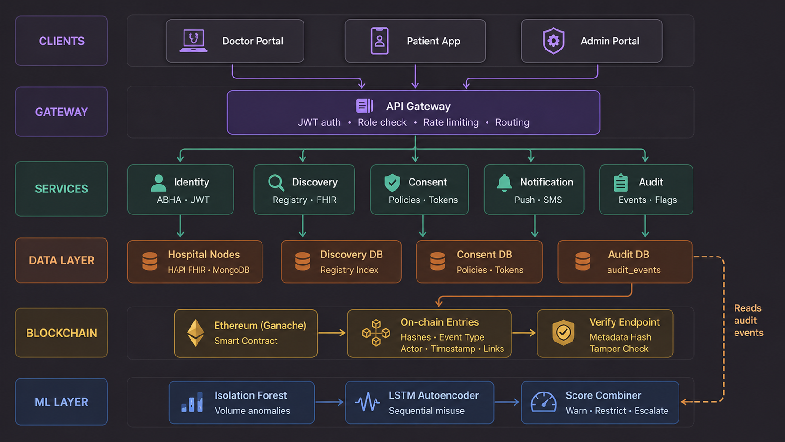

# Federated Medical Record Discovery and Secure Access System

> **Status: 🚧 Under Active Development (Build Phase)**
> Phase 1 (design & documentation) is complete. Phase 2 (full prototype implementation) is in progress. See [Project Status](#project-status) below for what's built vs. planned.

A federated health information exchange system that lets doctors discover and access consolidated patient records across hospitals, while giving patients full control over who sees their data — without any single system owning or centralizing the records themselves.

**Core philosophy:** *Hospitals own the records, patients own the permissions, the system owns nothing.*

---

## Table of Contents

- [Problem Statement](#problem-statement)
- [Architecture Overview](#architecture-overview)
- [Tech Stack](#tech-stack)
- [Key Features](#key-features)
- [Project Status](#project-status)
- [Repository Structure](#repository-structure)
- [Getting Started](#getting-started)
- [Demo Scenarios](#demo-scenarios)
- [Documentation](#documentation)
- [Team](#team)
- [License](#license)

---

## Problem Statement

Two core gaps in current healthcare IT motivate this project:

1. **Doctors** cannot access a consolidated view of a patient's medical history when that history is spread across multiple hospitals and providers.
2. **Patients** cannot easily access a portable, secure digital copy of their own records, or control who is allowed to see them.

This system addresses both by combining standards-based interoperability (FHIR), tamper-evident audit logging (blockchain), fine-grained consent management, and ML-based misuse detection.

---

## Architecture Overview

| Layer | Purpose |
|---|---|
| **Federation Layer** | HL7 FHIR R4 (HAPI FHIR) across three simulated hospital nodes — no central record store |
| **Consent & Access Control** | Patient-driven permissions, with a supervised break-glass override for emergencies |
| **Audit Layer** | Ethereum smart contracts (Solidity, Ganache) log every access event immutably |
| **Anomaly Detection** | Dual-pipeline ML (Isolation Forest + LSTM Autoencoder) flags suspicious access patterns |
| **Access Points** | React.js web portal (clinical staff), Flutter mobile app (patients) |



### Break-Glass Emergency Access

A three-layer supervisor model governs emergency access to records without prior consent:

1. **Automated rule engine** — handles routine, low-risk cases
2. **Hospital-designated doctor supervisor** — reviews complex cases
3. **Independent ethics board** — governance-level escalations

All break-glass events, and any time extensions to them, are recorded distinctly on-chain from normal access events. A 15-minute read-only grace window applies after token expiry.

---

## Tech Stack

- **Interoperability:** HL7 FHIR R4, HAPI FHIR
- **Blockchain:** Ethereum, Solidity, Ganache
- **Backend:** Node.js (microservices), Python / FastAPI
- **Frontend:** React.js (web), Flutter (patient mobile app)
- **Data:** MongoDB
- **Infrastructure:** Docker (multi-container, 11 services)
- **ML:** Isolation Forest, LSTM Autoencoder (unified score combiner, 4-tier graduated response)
- **Synthetic Data:** Synthea (MITRE) for FHIR-compliant synthetic patients; MIMIC-III used as a calibration reference

---

## Key Features

- 🔗 Federated FHIR-based record discovery across independent hospital nodes (no central patient database)
- 🔐 Patient-controlled, granular consent management — separate from token expiry
- 🚨 Supervised break-glass emergency access with immutable audit trail
- 🧬 Two-layer family history model (patient-reported vs. verified/consented records)
- 🤖 Real-time ML anomaly detection across two threads: general access anomalies + break-glass misuse
- 🏥 Tiered user roles: Doctors, Emergency Staff, Patients, Diagnostic Labs (top priority) down to Research Institutions, Pharma, Government, and Auditors (low priority)
- 🔬 Governed research data access via a secure anonymized data enclave

---

## Project Status

### ✅ Completed (Phase 1 — Design & Documentation)
- [x] System architecture design
- [x] Database schema design
- [x] Smart contract design
- [x] Docker environment design (11-container topology)
- [x] ML model design (dual-pipeline anomaly detection)
- [x] API service design
- [x] Implementation plan

### 🚧 In Progress (Phase 2 — Prototype Implementation)
- [ ] FHIR federation layer across three simulated hospital nodes
- [ ] Full smart contract implementation & on-chain audit logging
- [ ] Consent & access control service
- [ ] Break-glass override workflow (end-to-end)
- [ ] ML model training (Isolation Forest + LSTM Autoencoder)
- [ ] API gateway
- [ ] React.js clinical portal
- [ ] Flutter patient mobile app
- [ ] Full Docker Compose orchestration
- [ ] Synthetic patient dataset generation (Synthea)

### 📋 Planned Demos
- **Demo 1:** Standard clinical journey across three institutions
- **Demo 2:** Emergency break-glass access (drug allergy preventing a medication error)
- **Demo 3:** Patient Flutter app walkthrough
- **Demo 4:** ML anomaly detection layer (general + break-glass misuse detection)

---

## Repository Structure

> Structure will evolve as implementation progresses. Current planned layout:

```
.
├── docs/                   # Architecture docs, diagrams, Phase 1 report, presentation
├── contracts/               # Solidity smart contracts
├── services/
│   ├── fhir-federation/     # FHIR node integration services
│   ├── consent-service/     # Consent & access control
│   ├── audit-service/       # Blockchain audit logging
│   └── ml-anomaly/          # Isolation Forest + LSTM anomaly detection
├── api-gateway/              # FastAPI / Node.js API gateway
├── web-portal/               # React.js clinical staff portal
├── mobile-app/                # Flutter patient app
├── data/                       # Synthetic data generation scripts (Synthea)
├── docker-compose.yml
└── README.md
```

---

## Getting Started

> ⚠️ Full setup instructions will be added once the initial services are implemented and containerized.

Planned prerequisites:
- Docker & Docker Compose
- Node.js
- Python 3.x
- Flutter SDK
- Ganache (`--deterministic` flag)

```bash
# Setup commands will be documented as services are implemented.
git clone https://github.com/aditya-rathore04/federated-ehr-access.git
cd federated-ehr-access
```

---

## Demo Scenarios

In addition to the four core interactive demos above, three document-only scenarios are planned to illustrate edge cases:

- Genetic disorder case (family history / Layer 2 consent chains)
- Consent conflict resolution
- Research data access request (secure enclave, patient opt-in)

---

## Documentation

- [System architecture](docs/00_system_architecture.md)
- [Database schema](docs/01_database_schema.md)
- [Smart contract design](docs/02_smart_contract.md)
- [Docker environment](docs/03_docker_environment.md)
- [ML model design](docs/04_ml_model_design.md)
- [API service design](docs/05_api_service_design.md)
- [Project build phases](docs/project_build_phases.md)

---

## License

This project is licensed under the [MIT License](LICENSE).
