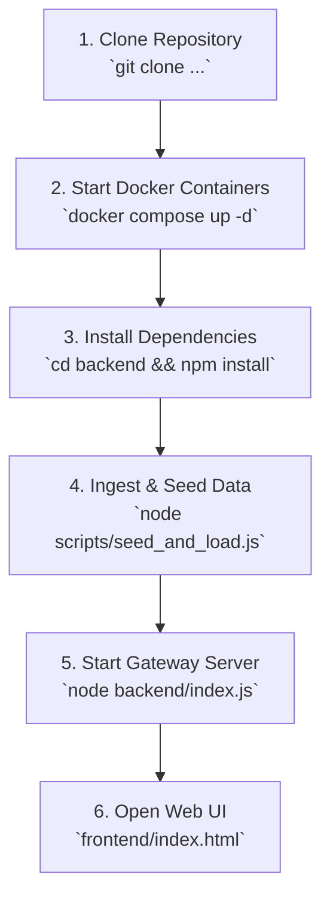

# Federated EHR System — Team Onboarding & Setup Guide

Welcome to the **Federated Medical Record Discovery and Secure Access System** project! This guide walks you through setting up your local development environment from scratch.

---

## 📋 Table of Contents
1. [Prerequisites](#1-prerequisites)
2. [Step-by-Step Setup](#2-step-by-step-setup)
   - [Step 1: Clone the Repository](#step-1-clone-the-repository)
   - [Step 2: Start Docker Infrastructure](#step-2-start-docker-infrastructure)
   - [Step 3: Verify Container Health](#step-3-verify-container-health)
   - [Step 4: Install Backend Dependencies](#step-4-install-backend-dependencies)
   - [Step 5: Configure Environment Variables](#step-5-configure-environment-variables)
   - [Step 6: Seed Synthetic Data & Registry](#step-6-seed-synthetic-data--registry)
   - [Step 7: Launch the Backend Gateway](#step-7-launch-the-backend-gateway)
   - [Step 8: Open the Frontend Discovery Portal](#step-8-open-the-frontend-discovery-portal)
3. [Network Topology & Port Map](#3-network-topology--port-map)
4. [Demo Credentials & Test Profiles](#4-demo-credentials--test-profiles)
5. [Daily Workflow for Developers](#5-daily-workflow-for-developers)
6. [Troubleshooting & FAQs](#6-troubleshooting--faqs)

---

## 1. Prerequisites

Before starting, ensure the following software is installed on your machine:

| Tool | Recommended Version | Download / Check |
|---|---|---|
| **Git** | `v2.30+` | `git --version` • [git-scm.com](https://git-scm.com/) |
| **Node.js** | `v18.x` or `v20.x+` (with npm) | `node --version` • [nodejs.org](https://nodejs.org/) |
| **Docker Desktop** | Latest (WSL 2 backend on Windows) | `docker --version` • [docker.com](https://www.docker.com/products/docker-desktop/) |
| **Browser** | Chrome / Edge / Firefox | Any modern web browser |
| **MongoDB Compass** *(Optional)* | Latest | [mongodb.com/try/download/compass](https://www.mongodb.com/try/download/compass) |

> [!IMPORTANT]
> **Windows Users:** During Docker Desktop installation, ensure **"Use WSL 2 instead of Hyper-V"** is checked. Ensure Docker Desktop is running (green status icon in bottom-left) before running any Docker commands.

---

## 2. Step-by-Step Setup



---

### Step 1: Clone the Repository
Open your terminal (PowerShell, Command Prompt, or Bash) and clone the repository:

```bash
git clone https://github.com/aditya-rathore04/federated-ehr-access.git
cd federated-ehr-access
```

---

### Step 2: Start Docker Infrastructure
Ensure Docker Desktop is open and running, then start the **7 multi-container services**:

```bash
docker compose up -d
```

> **What this does:**
> - Spins up **3 HAPI FHIR nodes** (Apollo `:8081`, Fortis `:8082`, Max `:8083`).
> - Spins up **4 MongoDB databases** (`:27017`, `:27018`, `:27019`, and central system registry on `:27020`).
> - Connects all services on the private bridge network `mednet`.

---

### Step 3: Verify Container Health
Check that all 7 containers are running (`Up` status):

```bash
docker compose ps
```

*Expected output:*
```
NAME              IMAGE                     STATUS         PORTS
hospital1-fhir    hapiproject/hapi:latest   Up             0.0.0.0:8081->8080/tcp
hospital1-mongo   mongo:7                   Up             0.0.0.0:27017->27017/tcp
hospital2-fhir    hapiproject/hapi:latest   Up             0.0.0.0:8082->8080/tcp
hospital2-mongo   mongo:7                   Up             0.0.0.0:27018->27017/tcp
hospital3-fhir    hapiproject/hapi:latest   Up             0.0.0.0:8083->8080/tcp
hospital3-mongo   mongo:7                   Up             0.0.0.0:27019->27017/tcp
system-mongo      mongo:7                   Up             0.0.0.0:27020->27017/tcp
```

> [!NOTE]
> HAPI FHIR containers take **~30–45 seconds** on initial startup to initialize their Spring Boot contexts.

---

### Step 4: Install Backend Dependencies
Navigate to the `backend/` directory and install the required npm packages:

```bash
cd backend
npm install
cd ..
```

---

### Step 5: Configure Environment Variables
Copy the environment template in the `backend/` directory:

- **On Windows (PowerShell):**
  ```powershell
  Copy-Item backend\.env.example backend\.env
  ```
- **On macOS / Linux:**
  ```bash
  cp backend/.env.example backend/.env
  ```

Default `.env` contents:
```env
PORT=3000
MONGO_URI=mongodb://localhost:27020
JWT_SECRET=super-secret-demo-key-federated-ehr-2026
```

---

### Step 6: Seed Synthetic Data & Registry
From the project root directory, run the automated data ingestion pipeline:

```bash
node scripts/seed_and_load.js
```

> **What this script does:**
> 1. Waits for all 3 HAPI FHIR servers to become healthy.
> 2. Preloads hospital and practitioner directory bundles.
> 3. Ingests **30 Synthea patient bundles** (10 per hospital node).
> 4. Ingests and links the clean primary demo patient **`AdhiRaj`** (`ABHA-DEMO-001`) across all **3 hospital nodes**.
> 5. Seeds `system_db.users` and `registry_db.registry_entries` in `system-mongo`.

*Expected output ending with:*
```
Successfully saved 33 users in system_db.users
Successfully saved 32 registry index records in registry_db.registry_entries
=== Ingestion & Seeding Complete! ===
```

---

### Step 7: Launch the Backend Gateway
Start the Express API gateway server:

```bash
node backend/index.js
```

You should see:
```
Connected to MongoDB at mongodb://localhost:27020
Federated EHR Gateway running on http://localhost:3000
```

---

### Step 8: Open the Frontend Discovery Portal
1. Open [`frontend/index.html`](frontend/index.html) in your browser.
2. Click **"DOC-1"** (or type `DOC-1`) and press **"Verify & Enter Dashboard →"**.
3. You will be redirected to the **Clinical Discovery Dashboard** ([`frontend/dashboard.html`](frontend/dashboard.html)) greeting you as **`Dr. Sharma`**.
4. Click the quick suggestion chip **`ABHA-001 (AdhiRaj • 3 Hospitals)`** or enter `ABHA-DEMO-001` and click **"Query Registry →"** to see federated records discovered across all 3 hospitals!

---

## 3. Network Topology & Port Map

| Component / Node | Type | Port | Purpose |
|---|---|---|---|
| **API Gateway** | Express.js / Node | `3000` | REST API, JWT authentication, patient discovery |
| **Apollo Memorial Hospital** | HAPI FHIR (R4) | `8081` | Hospital 1 decentralized FHIR endpoint |
| **Apollo MongoDB** | Mongo 7 | `27017` | Hospital 1 local datastore |
| **Fortis Healthcare Center** | HAPI FHIR (R4) | `8082` | Hospital 2 decentralized FHIR endpoint |
| **Fortis MongoDB** | Mongo 7 | `27018` | Hospital 2 local datastore |
| **Max Super Specialty** | HAPI FHIR (R4) | `8083` | Hospital 3 decentralized FHIR endpoint |
| **Max MongoDB** | Mongo 7 | `27019` | Hospital 3 local datastore |
| **System Registry** | Mongo 7 | `27020` | Central index (`registry_db`) & user accounts (`system_db`) |

---

## 4. Demo Credentials & Test Profiles

### 👨‍⚕️ Demo Practitioner Accounts

| Practitioner ID | Email | Name & Role | Hospital Affiliation |
|---|---|---|---|
| `DOC-1` | `doc1@test.com` | Dr. Aditya Sharma (Doctor) | Apollo Memorial Hospital (`HOSP-1`) |
| `DOC-2` | `doc2@test.com` | Dr. Priya Patel (Doctor) | Fortis Healthcare Center (`HOSP-2`) |
| `DOC-EMERGENCY` | `er@test.com` | Dr. Rahul Verma (Emergency) | Apollo Memorial Hospital (`HOSP-1`) |

---

### 🏥 Test Patient ABHA IDs

| Patient Health ID | Name | Record Locations | Clinical Categories Available |
|---|---|---|---|
| **`ABHA-DEMO-001`** *(Primary)* | **AdhiRaj** | **All 3 Hospitals** (Apollo, Fortis, Max) | Conditions, Observations, Meds, Allergies, Lab Reports, Immunizations |
| **`ABHA-DEMO-002`** | Ali Krajcik | Apollo Memorial (`HOSP-1`) | Encounters, Conditions, Observations |
| **`ABHA-DEMO-011`** | Babara Gutkowski | Fortis Healthcare (`HOSP-2`) | Encounters, Medications, Allergies |
| **`ABHA-DEMO-021`** | Brady Olson | Max Super Specialty (`HOSP-3`) | Encounters, Diagnostic Reports, Immunizations |

---

## 5. Daily Workflow for Developers

### 🟢 Starting Your Work Session
1. Open Docker Desktop.
2. In terminal, start the containers:
   ```bash
   docker compose start
   ```
3. Start the backend:
   ```bash
   node backend/index.js
   ```
4. Open [`frontend/index.html`](frontend/index.html) in your browser.

---

### 🔴 Ending Your Work Session
1. In the backend terminal, press `Ctrl + C` to stop the server.
2. Pause the Docker containers:
   ```bash
   docker compose stop
   ```
   *(This preserves all database data so you don't need to re-seed next time).*

---

## 6. Troubleshooting & FAQs

### ❓ Issue: `'docker' is not recognized as a command`
- **Cause:** Your terminal was opened before Docker Desktop was installed or environment variables haven't refreshed.
- **Fix (Windows PowerShell):**
  ```powershell
  $env:Path = [System.Environment]::GetEnvironmentVariable("Path","Machine") + ";" + [System.Environment]::GetEnvironmentVariable("Path","User")
  ```
  Or restart your terminal / VS Code.

---

### ❓ Issue: `Failed to connect to MongoDB / ECONNREFUSED`
- **Cause:** `system-mongo` container on port `27020` has not started or is initializing.
- **Fix:**
  ```bash
  docker compose ps
  docker compose start system-mongo
  ```

---

### ❓ Issue: HAPI FHIR returns `404` or connection closed
- **Cause:** HAPI FHIR Java Spring Boot service takes ~30–45s on first boot to initialize.
- **Fix:** Wait 30 seconds, then verify readiness with:
  ```bash
  curl http://localhost:8081/fhir/metadata
  curl http://localhost:8082/fhir/metadata
  curl http://localhost:8083/fhir/metadata
  ```

---

### ❓ Issue: How to perform a completely fresh reset
If you ever want to wipe all databases and reload from scratch:
```bash
docker compose down
docker compose up -d
node scripts/seed_and_load.js
```
